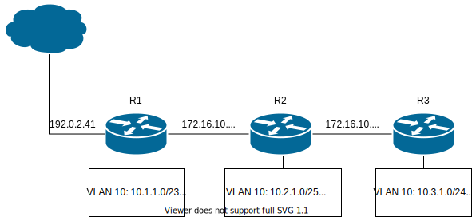

# EIGRP

| Attribut         | Wert               |
| ---------------- | ------------------ |
| Type             | Distanzbasiert     |
| Algorithmus      | DUAL               |
| Standard         | Cisco, Proprietär  |
| Protokoll        | IP, IPX, Appletalk |
| Port             | 88                 |
| Authenifizierung | MD5                |
| Multicast IP     | 224.0.0.10         |
| Hello Timmers    | 5/60               |
| Hold Timers      | 15/180             |

## Konfiguration




### Router 1

```
R1#conf t
R1(config)#interface GigabitEthernet 0/0
R1(config-if)#description WAN Link
R1(config-if)#ip addresse 192.0.2.41 255.255.255.0
R1(config-if)#interface GigabitEthernet 0/1
R1(config-if)#description Transfernet1
R1(config-if)#ip address 172.16.10.2 255.255.255.252
R1(config-if)#interface GigabitEthernet 0/2.10
R1(config-if)#encapsulation dot1q 10
R1(config-if)#ip address 10.1.1.1 255.255.254.0
R1(config-if)#interface GigabitEthernet 0/2.20
R1(config-if)#encapsulation dot1q 20
R1(config-if)#ip address 10.1.2.1 255.255.254.0
R1(config-if)#exit
R1(config)#router eigrp 100
R1(config-router)#network 10.1.1.0
R1(config-router)#passive-interface GigabitEthernet 0/0
R1(config-router)#exit
R1(config)#ip route 0.0.0.0 0.0.0.0 192.0.2.1
R1(config)#do wr
```

### Router 2

```
R2#conf t
R2(config)#interface GigabitEthernet 0/0
R2(config-if)#description Transfernet1
R2(config-if)#ip addresse 172.16.10.3 255.255.255.252
R2(config-if)#interface GigabitEthernet 0/1
R2(config-if)#description Transfernet2
R2(config-if)#ip address 172.16.10.5 255.255.255.252
R2(config-if)#interface GigabitEthernet 0/2.10
R2(config-if)#encapsulation dot1q 10
R2(config-if)#ip address 10.2.1.1 255.255.255.128
R2(config-if)#interface GigabitEthernet 0/2.20
R2(config-if)#encapsulation dot1q 20
R2(config-if)#ip address 10.2.20.1 255.255.254.0
R2(config-if)#interface GigabitEthernet 0/2.30
R2(config-if)#encapsulation dot1q 30
R2(config-if)#ip address 10.2.200.1 255.255.255.0
R2(config-if)#exit
R2(config)#router eigrp 100
R2(config-router)#network 10.2.1.0
R2(config-router)#network 10.2.20.0
R2(config-router)#network 10.2.200.0
R2(config-router)#exit
R2(config)#do wr
```

### Router 3

```
R3#conf t
R3(config)#interface GigabitEthernet 0/0
R3(config-if)#description Transfernet2
R3(config-if)#ip addresse 172.16.10.6 255.255.255.252
R3(config-if)#interface GigabitEthernet 0/2.10
R3(config-if)#encapsulation dot1q 10
R3(config-if)#ip address 10.3.1.1 255.255.255.0
R3(config-if)#interface GigabitEthernet 0/2.20
R3(config-if)#encapsulation dot1q 20
R3(config-if)#ip address 10.3.2.1 255.255.255.0
R3(config-if)#exit
R3(config)#router eigrp 100
R3(config-router)#network 10.3.1.0
R3(config-router)#exit
R3(config)#do wr
```

## Troubelshooting

```
show ip eigrp interfaces
show ip eigrp neighbors
show ip eigrp topology
show ip eigrp traffic
clear ip eigrp neighbors
debug ip eigrp [packet | neighbors]
```
